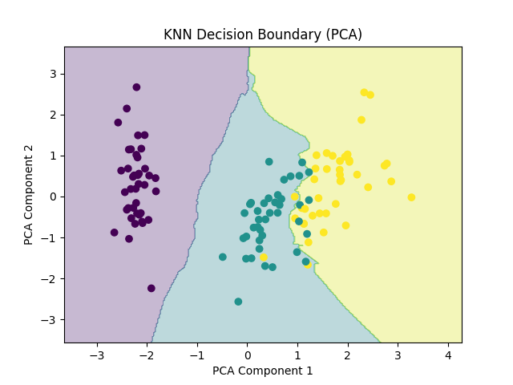
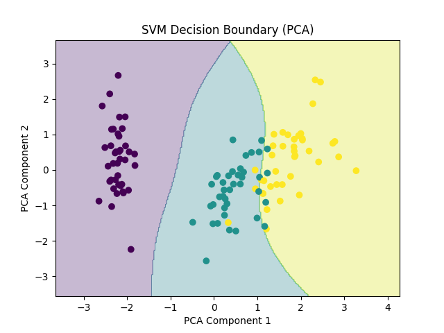

# 🌸 Iris Classification — KNN vs SVM

A clean, production-style machine learning project comparing **K-Nearest Neighbors (KNN)** and **Support Vector Machine (SVM)** classifiers on the classic **Iris Flower Dataset**.

This project focuses on **proper ML workflow**, **model comparison**, **robust evaluation**, and **interpretable visualizations** — without using notebooks.

---

## 📌 Project Overview

The goal is to classify iris flowers into three species:

* **Setosa**
* **Versicolor**
* **Virginica**

using four numerical features:

* Sepal length
* Sepal width
* Petal length
* Petal width

Two fundamentally different algorithms are implemented and compared:

* **KNN** → distance-based, instance-driven learning
* **SVM (RBF Kernel)** → margin-based, generalized learning

---

## 🧠 Why KNN vs SVM?

| Aspect            | KNN             | SVM                 |
| ----------------- | --------------- | ------------------- |
| Learning type     | Lazy learner    | Eager learner       |
| Decision logic    | Distance voting | Margin maximization |
| Noise sensitivity | High            | Low                 |
| Boundary shape    | Irregular       | Smooth              |
| Inference speed   | Slow            | Fast                |

This makes them ideal candidates for a **meaningful comparison**.

---

## 📁 Project Structure

```
iris-knn-svm/
│
├── data/
│   └── iris.csv
│
├── src/
│   ├── load_data.py
│   ├── preprocess.py
│   ├── train_knn.py
│   ├── train_svm.py
│   ├── evaluate.py
│   └── visualize.py
│
├── knn.png
├── svm.png
├── main.py
├── requirements.txt
└── README.md
```

---

## 📊 Dataset

* **Source:** Iris dataset (originally by Ronald Fisher)
* **Samples:** 150
* **Features:** 4 numeric
* **Classes:** 3

The dataset is stored locally as `data/iris.csv`.
Class labels are encoded numerically during preprocessing.

---

## ⚙️ Preprocessing

* Stratified train-test split (80/20)
* Feature scaling using **StandardScaler**
* Label encoding for class targets

Scaling is critical for SVM since it relies on distance-based calculations.

---

## 🤖 Models Implemented

### 🔹 K-Nearest Neighbors (KNN)

* `k = 5`
* Euclidean distance
* Sensitive to local data structure

### 🔹 Support Vector Machine (SVM)

* Kernel: **RBF (Gaussian)**
* `C = 1.0`
* `gamma = scale`
* Learns a smooth maximum-margin boundary

---

## 📈 Evaluation Metrics

Each model is evaluated using:

* Accuracy
* Precision
* Recall
* F1-score
* Confusion Matrix

### ✅ Results Summary

| Model | Accuracy   |
| ----- | ---------- |
| KNN   | **93.33%** |
| SVM   | **96.67%** |

SVM performs better, especially in overlapping class regions.

---

## 🖼️ Decision Boundary Visualization (PCA)

Since the dataset has 4 dimensions, **PCA is used to project data into 2D** for visualization purposes.

### 🔸 KNN Decision Boundary

* Irregular regions
* Sensitive to overlapping samples



---

### 🔸 SVM Decision Boundary

* Smooth, generalized separation
* Better margin handling



> **Note:** These plots are PCA projections for interpretability and do not represent the full 4D decision space.

---

## ▶️ How to Run

### 1️⃣ Install dependencies

```bash
pip install -r requirements.txt
```

### 2️⃣ Run the project

```bash
python main.py
```

This will:

* Train both models
* Print evaluation metrics
* Display decision boundary plots

---

## 🧪 Key Learnings

* SVM generalizes better on overlapping classes due to margin optimization
* KNN is intuitive but sensitive to noise and scaling
* Feature scaling is mandatory for SVM
* PCA is useful for visualizing high-dimensional decision boundaries

---

## 🚀 Future Improvements

* Hyperparameter tuning with GridSearchCV
* Cross-validation
* Probability calibration for SVM
* Additional classifiers for comparison

---

## 📌 Conclusion

This project demonstrates a **clean ML engineering workflow**, meaningful **algorithm comparison**, and **interpretable visualization** — making it suitable for portfolios, interviews, and learning reinforcement.

---

⭐ If you found this useful, consider starring the repository.
